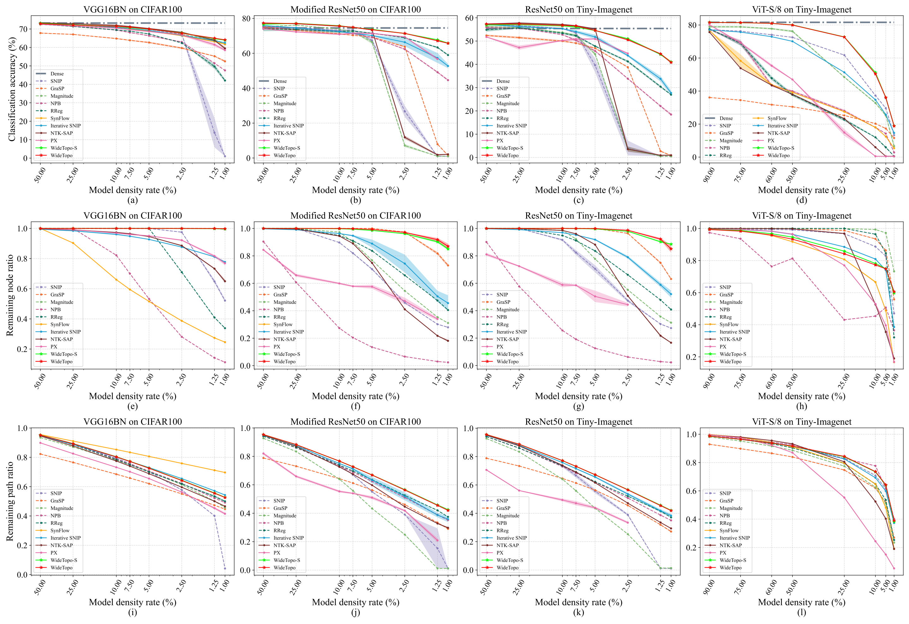
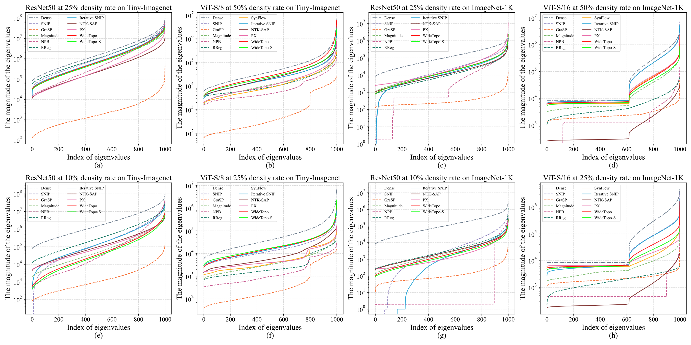

# WideTopo

Official implementation of **"WideTopo: Improving Foresight Neural Network Pruning through Training Dynamics Preservation and Wide Topologies Exploration"**.

## 📋 Abstract

WideTopo is a novel foresight neural network pruning method that addresses key limitations of existing pruning-at-initialization (PaI) techniques. By integrating Neural Tangent Kernel (NTK) theory with Implicit Target Alignment (ITA), WideTopo preserves training dynamics while exploring wide network topologies to identify structurally stable sub-networks with superior post-training performance. WideTopo addresses the limitations of existing methods by:

- **Preserving Training Dynamics**: Integrating Neural Tangent Kernel (NTK) theory with Implicit Target Alignment (ITA) to capture training dynamics of sub-networks
- **Exploring Wide Topologies**: Employing density-aware saliency score decay and repeated mask restoration strategies to maintain network width

Our method demonstrates competitive performance on diverse architectures (CNNs and ViTs) across multiple datasets under both random and pre-trained initialization settings.

## 🔧 Algorithm Overview

WideTopo combines three key components:

1. **Saliency Scores with Training Dynamics**:
   - NTK trace estimation via Hutchinson's method
   - Implicit Target Alignment (ITA) measurement
   - Combined score: $S(m_j) = \mu_1 S_{NTK}(m_j) + \mu_2 S_{ITA}(m_j)$

2. **Density-Aware Score Decay**:
   - Prioritizes pruning dense connections over sparse ones
   - Adapts based on global model density and local node density

3. **Repeated Mask Restoration**:
   - Reactivates over-pruned parameters to prevent node isolation
   - Maintains effective paths and wide network topology

## 💻 Usage

### Prerequisites

```bash
Python >= 3.8
PyTorch >= 1.9
torchvision >= 0.10
CUDA >= 11.1 (recommended)
```

### Installation

```bash
git clone https://github.com/Memoristor/WideTopo.git
cd WideTopo
pip install -r requirements.txt
```

### Example

```python
# run for imagenet dataset
./scripts/foresight_pruner_v3_prune_train_valid.sh configs/foresight_pruning/imagenet/<pruner>/<file_name>.yaml <random_seed> <prune_gpus> <prune_args> <valid_gpus> <valid_args>

# example (`-s` means convert BN to SyncBN)
./scripts/foresight_pruner_v3_prune_train_valid.sh configs/foresight_pruning/imagenet/widetopo_s/resnet18_224x224_bs512_ep90_sgd_lr4e-1_wd_1e-4_mstep_1e-1_30_60_80_ce_widetopo_s_1e-1_foresight_pruning_imagenet.yaml 212 0,1 "-s" 0,1 "-s"

# run for pascal context dataset
./scripts/foresight_pruner_v3_prune_train_valid_test.sh configs/foresight_pruning/pascalctx/<pruner>/<file_name>.yaml <random_seed> <prune_gpus> <prune_args> <valid_gpus> <valid_args> <test_gpus> <test_args>

# example
./scripts/foresight_pruner_v3_prune_train_valid_test.sh configs/foresight_pruning/pascalctx/widetopo_s/deeplabv3_plus_resnet50_480x480_bs16_ep90_sgd_lr1e-2_wd_1e-4_poly_9e-1_ce_widetopo_1e-1_foresight_pruning_no_winit_pascalctx.yaml 212 0,1 "-s" 0,1 "-s" 0 ""
```

## 📈 Experimental Results

### Comparision on Small Dataset



### Eigenvalues of NTK




## 🎓 Citation

If you find this work useful, please cite our paper:

```bibtex
@article{deng_widetopo_2026,
  title = {WideTopo: Improving foresight neural network pruning through training dynamics preservation and wide topologies exploration},
  author = {Deng, Changjian and Cheng, Jian and Su, Yanzhou and An, Zeyu and Yang, Zhiguo and Xia, Ziying and Zhang, Yijie and Wang, Shiguang},
  year = 2026,
  month = feb,
  journal = {Neural Networks},
  volume = {194},
  pages = {108136}
}
```

## 📄 License

This project is licensed under the MIT License - see the [LICENSE](LICENSE) file for details.
